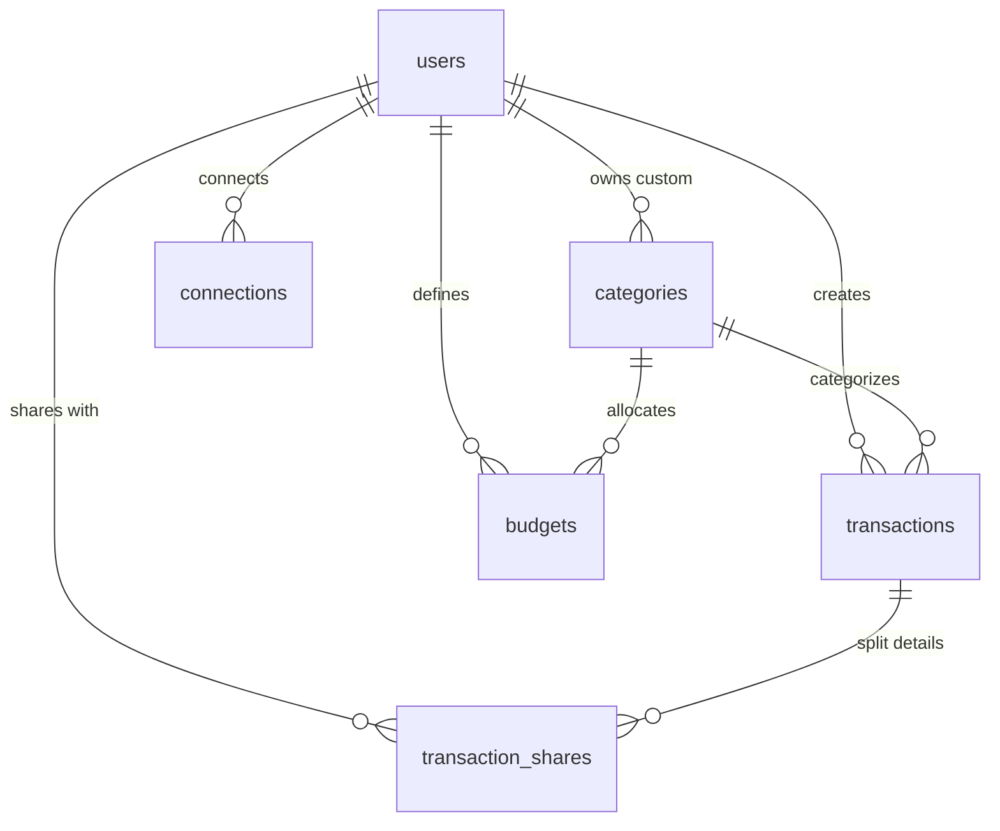

# System Structure Documentation

This document provides a comprehensive overview of the consolidated **Deno Financial Management System (FMS)** architecture, source code organization, and database schema design.

---

## 1. Technical Stack Overview

The project is built as a lightweight, modern full-stack application using Deno. It features:
*   **Runtime:** [Deno](https://deno.land/) (v2.x) with secure-by-default execution.
*   **Web Framework:** [Hono](https://hono.dev/) for high-performance, type-safe routing and HTML generation.
*   **Database ORM:** [Drizzle ORM](https://orm.drizzle.team/) with [postgres.js](https://github.com/porsager/postgres) driver.
*   **Styling & UI:** [Tailwind CSS](https://tailwindcss.com/) (loaded via CDN with custom configuration) implementing the **"Earthbound Matte"** tactile neo-brutalist theme.
*   **Interactivity:** [HTMX](https://htmx.org/) for seamless, AJAX-driven page updates without full page reloads.
*   **Security:** [Argon2](https://jsr.io/@felix/argon2) for password hashing and custom JWTs (JSON Web Tokens) for authentication.

---

## 2. Directory Structure

```text
financial_management/
├── app/                        # Main Deno application source
│   ├── src/                    # Source code
│   │   ├── core/               # Shared system infrastructure
│   │   │   ├── db.ts           # Drizzle ORM client initialization
│   │   │   ├── schema.ts       # Database tables and relationship schemas
│   │   │   ├── seeds.ts        # Database seeding script for test accounts
│   │   │   ├── middleware/     # Hono middleware (auth, RBAC, ABAC)
│   │   │   └── utils/          # Utility placeholders
│   │   │
│   │   ├── modules/            # Feature modules (modular encapsulation)
│   │   │   ├── auth/           # Login, registration pages and handlers
│   │   │   └── dashboard/      # Main financial dashboard and feed
│   │   │
│   │   ├── ui/                 # Reusable layout and style assets
│   │   │   ├── components/     # Button, Card, Icon, Select components
│   │   │   └── layouts/        # Base HTML layout wrapping all pages
│   │   │
│   │   ├── main.ts             # Application entry point
│   │   └── routes.ts           # Central router mapping module routers
│   │
│   ├── tests/                  # Integration and unit tests
│   │   └── auth.middleware.test.ts
│   │
│   ├── drizzle/                # Database migrations output folder
│   ├── deno.json               # Deno task, import, and compiler configuration
│   └── deno.lock               # Dependency lockfile
│
├── docs/                       # Project documentation and specifications
│   ├── system/                 # Detailed system structure and planning (this folder)
│   └── PRDs/                   # Product Requirements Documents
│
└── docker-compose.yaml         # Local environment setup (app + PostgreSQL)
```

---

## 3. Core Database Schema & Data Models

Defined in [schema.ts](file:///home/mark/workspace/lab/financial_management/app/src/core/schema.ts), the database structure enforces relational integrity, financial precision, and auditability.

### Key Data Architecture Decisions
1.  **Financial Precision:** Amounts are stored as `bigint` instead of floating-point numbers to avoid rounding issues. These are interpreted as the smallest currency unit (e.g., cents for USD/EUR, whole units for JPY).
2.  **Immutability:** The system design targets an **Immutable Ledger** for transactions. There are no update or delete routes for transaction entries.
3.  **Idempotency:** Transactions require an `idempotencyKey` (UUID) to prevent duplicate submissions or double-charging.
4.  **Granular Sharing:** The design supports sharing individual transactions with specific users (contacts) through junction tables.

### Table Schema Definitions



#### A. Users (`users`)
Stores user accounts and credentials.
*   `id` (UUID, Primary Key, Auto-generated)
*   `email` (Text, Unique, Not Null)
*   `passwordHash` (Text, Not Null) - Argon2 hash
*   `createdAt` / `updatedAt` (Timestamp, Default Now)

#### B. Categories (`categories`)
Groups transactions. Supports global categories (system-defined) and user-specific categories.
*   `id` (UUID, Primary Key, Auto-generated)
*   `name` (Text, Not Null)
*   `icon` (Text, Nullable) - Reference to Material Symbol icon name
*   `userId` (UUID, Nullable, Foreign Key -> `users.id`) - Null signifies a global/default category

#### C. Transactions (`transactions`)
The primary financial ledger.
*   `id` (UUID, Primary Key, Auto-generated)
*   `userId` (UUID, Not Null, Foreign Key -> `users.id`, On Delete Restrict)
*   `type` (Enum: `INCOME`, `EXPENSE`, Not Null)
*   `amount` (BigInt, Not Null) - Must be positive (`positiveAmount` check constraint >= 0)
*   `currency` (Varchar(3), Not Null) - ISO 3-letter currency code (e.g. 'USD')
*   `idempotencyKey` (UUID, Unique, Not Null) - Enforces single submission
*   `categoryId` (UUID, Not Null, Foreign Key -> `categories.id`)
*   `date` (Date, Not Null)
*   `note` (Text, Nullable)
*   `createdAt` (Timestamp, Default Now)

#### D. Transaction Shares (`transaction_shares`)
Facilitates collaborative bill-splitting or joint expense tracking.
*   `transactionId` (UUID, Not Null, Foreign Key -> `transactions.id`, On Delete Cascade)
*   `sharedWithUserId` (UUID, Not Null, Foreign Key -> `users.id`)
*   `shareAmount` (BigInt, Not Null) - The recipient's allocated share of the transaction
*   `createdAt` (Timestamp, Default Now)
*   *Composite Primary Key:* (`transactionId`, `sharedWithUserId`)

#### E. Budgets (`budgets`)
Allows setting target limits.
*   `id` (UUID, Primary Key, Auto-generated)
*   `userId` (UUID, Not Null, Foreign Key -> `users.id`)
*   `categoryId` (UUID, Nullable, Foreign Key -> `categories.id`) - Null means an overall monthly budget
*   `amount` (BigInt, Not Null)
*   `currency` (Varchar(3), Not Null)
*   `monthYear` (Date, Not Null) - Represented by the 1st of that month

#### F. Connections (`connections`)
Enables user-to-user trusted networking.
*   `id` (UUID, Primary Key, Auto-generated)
*   `userId` (UUID, Not Null, Foreign Key -> `users.id`) - Inviter
*   `contactId` (UUID, Not Null, Foreign Key -> `users.id`) - Invitee
*   `status` (Enum: `PENDING`, `ACCEPTED`, Default `PENDING`)
*   `createdAt` (Timestamp, Default Now)

---

## 4. Current Module Implementation Status

### A. Auth Module (`app/src/modules/auth`)
*   **Repository:** Database access methods `findByEmail` and `createUser` are implemented in Drizzle.
*   **Service:** Login authentication checks the email, verifies the password using Argon2, and returns a signed JWT using the `JWT_SECRET`.
*   **Router:** Form handlers for `GET /login`, `GET /register`, and `POST /login`. Sets cookie-based JWT authorization.
*   **Views:** Tactile Earthbound styled pages for Login and Register.

### B. Dashboard Module (`app/src/modules/dashboard`)
*   **Repository:** Empty placeholder class.
*   **Service:** Returns a mock payload containing a hardcoded balance and five hardcoded transactions.
*   **Router:** A protected router that verifies session cookies using `requireAuth`.
*   **Views:** An interactive HTML page displaying the sidebar navigation, total statement balance, filter selectors, and list of transactions grouped by month.

### C. System Core (`app/src/core`)
*   **Middleware:**
    *   `requireAuth`: Decodes and verifies token cookie; rejects non-auth requests (smart redirecting for standard, API, or HTMX requests).
    *   `requireRole`: Scaffolded RBAC checks.
    *   `requireOwnership`: Scaffolded ABAC checks.
*   **Database Config:** Connected via `postgres.js` to Drizzle, and includes Drizzle migrations and seed scripts.
